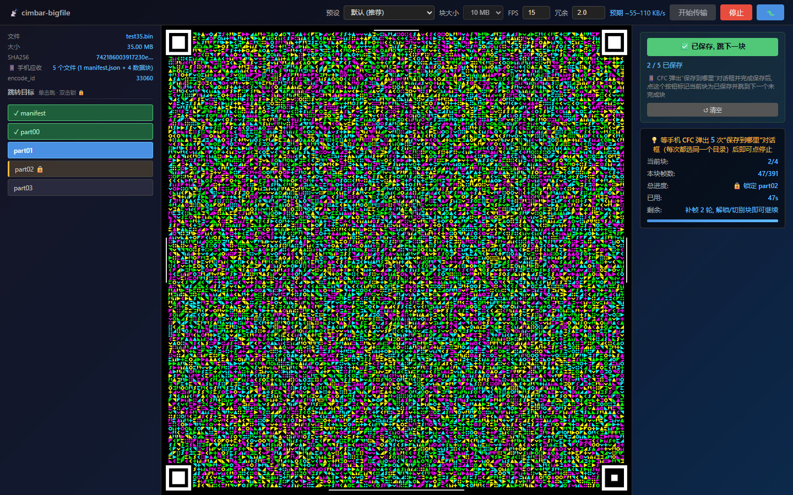

[中文](README.md) | **English**

🚀 **Try online**: [Sender](https://xpeipeix.github.io/cimbar-bigfile/send.standalone.html) · [Reassemble](https://xpeipeix.github.io/cimbar-bigfile/reassemble.html) · [Offline download](https://github.com/xPeiPeix/cimbar-bigfile/releases/latest)

# cimbar-bigfile

> An optical large-file transfer tool built on top of [sz3/libcimbar](https://github.com/sz3/libcimbar) — break past the single-stream wirehair capacity ceiling (~40.5 MB hard cap in Mode B) by running multiple fountain streams in parallel, enabling **100+ MB file transfers** (~1.2 GB theoretical single-session ceiling, see [manifest-spec](docs/manifest-spec.md#chunk_size-选择参考-wirehair-硬限制推导)) in fully air-gapped environments.

## What is this?

`cimbar-bigfile` is a **pure HTML/JS wrapper** around libcimbar that splits large files into chunks (default 10 MB — **libcimbar author recommends 10-15 MB as the sweet spot**, leaving redundancy headroom), encodes each chunk as an independent fountain-code stream (distinct `encode_id`), and plays them back as a colored-barcode animation on the screen.

The receiver uses sz3's **CameraFileCopy (CFC)** Android app to scan; CFC's built-in `fountain_decoder_sink` already supports concurrent per-`encode_id` bucketing natively, so **no app modifications are required**. Once all chunks are received, open the reassembly page in any browser, drop the files in, and the original file is reconstructed.

```
[Sender send.html]  →  on-screen animation  →  [Phone CFC]  →  N saved chunks  →  [Reassemble reassemble.html]  →  original file
```

## Usage

### Setup

1. **Receiver**: install [CameraFileCopy](https://github.com/sz3/cfc/releases) on a phone (F-Droid / Google Play / GitHub Release APK)
2. **Sender**: open `send.standalone.html` in a desktop browser (self-contained single file, no network needed, **recommended**)
3. **Reassembly**: open `reassemble.html` in any browser (zero-dependency vanilla JS, no network needed)

> You can also use the modular `send.html` (development build), but it requires a local HTTP server (see [Development](#development) below) — browsers block wasm loads under the `file://` scheme. The standalone build is simpler for end users.

The sender and reassembly pages **default to English**. Use the `中文` / `EN` button in the top-right corner to switch languages at any time; the browser remembers your choice across refreshes and future visits.

### Sending

1. Open `send.standalone.html`
2. Drop the file you want to transfer onto the page
3. Click "Start" ("开始传输" in Chinese) — the screen begins playing the colored-barcode animation
4. **Keep the screen still until all chunks are sent**

You can also collect ad-hoc content on the sender page before sending:

- `Ctrl+V` pasted text becomes a staged `clipboard-*.txt` file
- `Ctrl+V` pasted files, or "Add files" / "Add folder", appends items to the staged list
- "Pack and start" creates a local `cimbar-bundle-*.tar` archive in the browser and immediately sends it through the normal flow

Packing is fully local in the browser; nothing is uploaded. The archive is an uncompressed `.tar`, extractable with Windows `tar`, 7-Zip, and similar tools.

#### 💡 Speed up reception: jump · lock · confirm-saved

In multi-chunk mode (large files), the sender UI switches to a **three-column responsive layout**: left = jump list, center = cimbar code canvas, right = ✅ confirm-saved button + progress panel.



The **default sender behavior** cycles `manifest → part00 → part01 → ... → loop back to manifest`, and CFC happens to scan whichever chunk is currently on-screen — total scan time for a 100MB file is roughly **~55 minutes**.

**Three controls eliminate the wait**:

| Action | Effect | Trigger |
|---|---|---|
| **Single-click a chunk button** | Jump to that chunk immediately (clears any lock, resumes free loop) | Mouse click / Tab + Enter |
| **Double-click a chunk button** | 🔒 Lock to that chunk (sender stays on it, fountain keeps emitting new frames, CFC's next scan is guaranteed to land on it); double-click again or click another = transfer / unlock | Mouse double-click / Tab + **Shift+Enter** (keyboard equivalent) |
| **✅ Saved, jump to next** (green primary button in right panel) | Mark the current chunk as saved (persisted to localStorage) + auto-jump to the next unsaved chunk | Click it after CFC's "save where" dialog completes |

Button visual states (left column in screenshot):
- 🟢 `✓ prefix + green background` = confirmed saved
- 🔵 `blue background` = currently playing on screen (active)
- 🟡 `amber tint + 🔒` = double-click locked; the progress panel mirrors this as "🔒 Locked partXX · refill N rounds"

**Expected gain**: scan time for a 100MB file drops from **~55 min** to **~17 min** (random-scan wait eliminated).

> simpleMode (small files ≤ chunk size, single-stream direct send) hides the jump list — there is only 1 stream, so jumping is meaningless.

#### 🔍 Full-screen scanning

After transmission starts, click "Fullscreen code" ("全屏显示码图" in Chinese) to enlarge the cimbar code to fill the screen, making it easier for the phone camera to focus and scan. Full-screen mode hides the side panels but keeps a status bar outside the code image. Large transfers enter guided lock: the sender locks the current (or next unfinished) chunk, keeps emitting refill frames, and shows the current chunk, total chunk count, saved count, and a "✅ Saved, lock next" button. The status bar stays visible so a chunk cannot change while the phone's save dialog is open and then be marked incorrectly.

- Press `Esc` or click the floating exit control to return to the normal layout
- After CFC saves the current chunk, confirm it in the full-screen status bar; the sender switches to and locks the next unfinished chunk
- After every chunk is marked saved, the status bar says the transfer can stop and disables further confirmation
- The guided-lock status bar stays visible; move the pointer or focus a control with the keyboard to reveal the auto-fading exit control
- Exiting full-screen releases a lock added by guided mode; a manual lock that existed before entering is preserved
- Stopping the transmission automatically exits full-screen mode

### Receiving

1. Open CFC on the phone, point it at the desktop screen
2. After each chunk completes, CFC shows a "save where" dialog
3. **Always pick the same directory** (recommended: create a `cimbar-bigfile-job1/` folder)
4. After all chunks are received:
   - **Small file (≤ chunk size, default ≤ 10 MB)**: a single file with the original filename — **no reassembly needed**, what CFC saved IS the original file
   - **Large file (> chunk size)**: N+1 files — `manifest.json` + `<filename>.part00.bin` ... `<filename>.partNN.bin` — proceed to reassembly below

### Reassembly (large files only)

1. Transfer all files from the phone to the desktop (USB / email / any method)
2. Open `reassemble.html` in a browser
3. Select all files and drop them onto the page
4. SHA256 verification runs automatically → on success → the reconstructed original file is downloaded

The reassembly page also defaults to English and provides the same `中文` / `EN` language control. Switching languages does not clear selected files or reset the current verification state.

## Known limitations

- **CFC pops up a save dialog per chunk**: at 10MB / chunk, a 100MB file requires 11 "save" taps.
- **Throughput**: about **106 KB/s** (libcimbar Mode B default). 100MB files take an estimated 16-20 minutes.
- **Receiver: Android CFC recommended**: libcimbar upstream v0.6.4 release also ships a web decoder (this repo's `vendor/cimbar-wasm-v0.6.4/recv.html`), but it stalls mid-decode on larger files (≥ 3MB, see [issue #4](https://github.com/xPeiPeix/cimbar-bigfile/issues/4)), and its single-stream design cannot directly consume this repo's multi-stream chunked output (no per-`encode_id` bucketing).

## Troubleshooting

| Symptom | Likely cause | Fix |
|---------|--------------|-----|
| CFC scans nothing | Screen too dim / wrong distance | Max screen brightness, hold the phone 10-30 cm away |
| CFC scans very slowly | Frame rate too high for the camera | Lower send.html FPS to 10-12 |
| Some chunks never arrive | Insufficient fountain redundancy | Raise the "redundancy" slider in send.html to 2.0 or higher so the sender emits more frames per chunk |
| Reassembly SHA256 fails | A chunk was corrupted in transit | Identify the failing chunk → resend it (restart send.html with the same `encode_id_base` and jump to that chunk) |
| Browser fails to load wasm | `file://` CORS blocked (only the dev `send.html` has this issue) | Use `send.standalone.html` (just double-click), or run a local HTTP server: `python -m http.server 8000` and visit `http://localhost:8000/send.html` |
| Garbled filename | System encoding mismatch | manifest enforces UTF-8 — check browser/phone system encoding |
| Browser stutters | File too big, wasm heap pressure | Lower the chunk size (default 10MB → 5MB) |
| Total scan time too long | CFC resets fountain state per save, so the sender's looping makes hits luck-based | Use the new "jump buttons" to manually pin the next target chunk (see "Speed up reception" above) |

## Performance reference

Reference rig: 1080p screen + Pixel 5 + default settings (Mode B / 15 fps / 10 MB chunks / 2.0x redundancy)

| File size | Chunks | Save dialogs | Estimated time | Throughput (Mode B) |
|-----------|--------|--------------|----------------|---------------------|
| 5 MB | 1 chunk (direct, no manifest) | 1 | ~1 min | ~85 KB/s |
| 28 MB | 3 chunks | 4 (manifest + 3 parts) | ~4-5 min | ~100 KB/s |
| 100 MB | 10 chunks | 11 (manifest + 10 parts) | ~16-20 min | ~106 KB/s |

> Verification coverage: 5 MB (bundled `test/test-5m.bin`) + ~28 MB (manual end-to-end optical link) + 100 MB (application-layer round-trip via `scripts/test-round-trip-100mb.js`). Other sizes extrapolate linearly.
>
> Actual throughput depends heavily on lighting, screen brightness, and camera autofocus stability.

### Choosing a redundancy multiplier

The libcimbar author confirmed in a [sz3/libcimbar#165 comment](https://github.com/sz3/libcimbar/pull/165#issuecomment-4421610294) that **"no penalty for redundant blocks (e.g. 3x or 4x for 10 MB chunks)"** — which follows from how fountain code works:

- Redundancy only affects **how many frames the sender emits in total**, not how many CFC needs to finish decoding (CFC stops once it has enough independent frames)
- Surplus frames are silently ignored by CFC, **so they don't waste receive time**
- High redundancy's real value: **a thicker safety margin** when the first sender loop doesn't deliver every chunk cleanly

| redundancy | Use case |
|------------|----------|
| 1.2-1.5x | Tripod-mounted screen + good lighting + stable focus (aggressive preset) |
| **2.0x (default)** | Normal indoor lighting + handheld but steady (balanced preset) |
| 3.0-4.0x | Poor lighting / glare / visible hand-shake (conservative preset) |

The sender UI's redundancy input goes up to 5.0x for extreme conditions.

## Advanced: files larger than ~1.2 GB

A single session is bounded by wirehair's `uint16_t` encode_id slot — `chunk_count` should stay under ~120 (≈1.2 GB at 10 MB/chunk). **The libcimbar author noted two ways to push past this** in the [sz3/libcimbar#165 comment](https://github.com/sz3/libcimbar/pull/165#issuecomment-4421610294), both requiring manual babysitting:

**Option 1: vary the chunk size and restart the session**

> "Provided you're finished sending a chunk, you can re-use the encode_id if you slightly vary the chunk size... (e.g. 10.01 MB chunks after the first go around)"

Ship the first ~1.2 GB with 10 MB chunks; restart the sender for the remainder with a slightly different chunk size (e.g. 10.01 MB or 10.5 MB). wirehair treats the different chunk size as a new file, so old encode_id slots are not re-used.

**Option 2: restart the CFC decoder to clear its cache**

> "you can also restart the decoder to clear its cache of 'done' files, which will have the same effect without changing the chunk size"

Fully restart the CFC app — its `fountain_decoder_sink` cache of "done files" is wiped, freeing the encode_id slots. **Any partial progress from the previous round is also lost**, so this only fits "all chunks of the previous round were saved successfully, now starting a fresh round" scenarios.

⚠️ Neither option is automated inside cimbar-bigfile yet — both require manual user intervention. Arbitrarily large transfers are theoretically possible; the largest end-to-end verified size is currently 100 MB (see the performance table above).

## Development

### Updating the libcimbar dependency

See [`vendor/README.md` "Updating to newer libcimbar release"](vendor/README.md#updating-to-newer-libcimbar-release).

### Protocol specification

- [docs/manifest-spec.md](docs/manifest-spec.md) — manifest JSON field semantics
- [docs/architecture.md](docs/architecture.md) — data flow, wasm API, design decisions

### Local sender testing

```bash
# Run a local HTTP server (avoids the file:// CORS issue)
python -m http.server 8000
# Visit http://localhost:8000/send.html
```

### Building the self-contained single-file build

`send.standalone.html` is the "double-click and go" build for end users — vendor wasm + glue js are base64-inlined into the HTML so the page no longer needs an HTTP server. Rebuild every time the vendor is upgraded:

```bash
PYTHONIOENCODING=utf-8 PYTHONUTF8=1 python scripts/build-standalone.py
# Output: send.standalone.html (~2.5 MB)
```

The build script reads only `send.html` + `vendor/cimbar-wasm-v0.6.4/cimbar_js.*.js` + `cimbar_js.*.wasm`, and writes a standalone file to the repository root. Mechanism: replace `<script src="vendor/...">` with an inline `<script>` that base64-decodes into `Module.wasmBinary` — emscripten's glue detects this and skips the network fetch.

## Architecture & protocol

- Protocol spec: [docs/manifest-spec.md](docs/manifest-spec.md)
- Architecture diagram: [docs/architecture.md](docs/architecture.md)

## License & Acknowledgements

cimbar-bigfile is a thin wrapper around libcimbar. **This repository is jointly governed by three licenses: MIT, MPL-2.0, and BSD-3-Clause**:

| Component | License | Copyright | Notes |
|-----------|---------|-----------|-------|
| `send.html` / `reassemble.html` / `docs/*` and other original project code | **MIT** | © 2026 peipei | See [`LICENSE`](LICENSE) |
| `vendor/cimbar_js.html` / `vendor/cimbar-wasm-v0.6.4/*` | **MPL-2.0** | © sz3 (libcimbar) | See [`vendor/LICENSE-libcimbar`](vendor/LICENSE-libcimbar) |
| The wirehair fountain-code library embedded in the wasm above | **BSD-3-Clause** | © 2018 Christopher A. Taylor | See [`vendor/LICENSE-wirehair`](vendor/LICENSE-wirehair) |
| The CFC Android receiver (installed independently by the user, not vendored) | **MIT** | © sz3 | See [github.com/sz3/cfc](https://github.com/sz3/cfc) |

**MPL-2.0 source obligation**: this project distributes the libcimbar wasm binary (Executable Form). Per MPL-2.0 §3.2, the corresponding source code is freely available at https://github.com/sz3/libcimbar/tree/v0.6.4.

### Acknowledgements

- [sz3/libcimbar](https://github.com/sz3/libcimbar) — core fountain code + cimbar codec engine
- [sz3/cfc](https://github.com/sz3/cfc) — Android receiver app
- [catid/wirehair](https://github.com/catid/wirehair) — underlying fountain-code library
